# java8新特性

## 一:lambda表达式 


# 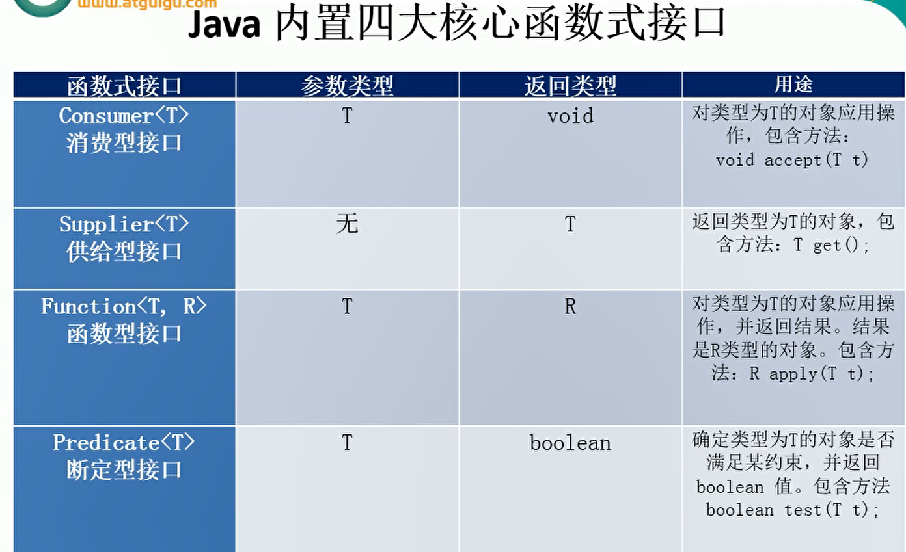


1. 接口中允许有默认方法, 继承和实现遵循类优先原则

   ```java
   /**
    * 类优先原则:
    *  -一个类继承了父类又实现了接口, 接口的默认方法和父类的方法一样, 则类优先原则规定还是调用父类的方法
    */
   ```

2. lambda表达式的实质是对接口的实现

3. ==**加了@FunctionalInterface注解的接口, 只能有一个未实现的方法, 我们称这个接口为函数式接口, lambda表达式是对这个方法的实现**==

4. lambda表达式基础:

```java
/**
 * 一: Lambda表达式的语法基础: java8中引入了一个新的操作符'->', 该操作符成为箭头操作符或Lambda操作符
 *
 * 语法格式一:
 *  -无参数, 五返回值
 *      ()->System.out.println("hello jacklu")
 *
 * 语法格式二:
 *  -有一个参数, 并且无返回值
 *      (x)->System.out.println(x)
 *
 * 语法三:
 *  -若只有一个参数, 小括号可以省略不写
 *      x->System.out.println(x)
 *
 *  语法格式四:
 *      -有两个以上的参数, 有返回值, 并且Lambda 体中有多条语句
 *      Comparator<Integer> com = (x, y)->{
 *          System.out.println("函数式接口");
 *          return Integer.compare(x,y);
 *      }
 *
 *  语法格式五:
 *      -若Lambda体中只有一条语句, return和大括号都可以省略不写
 *      Comparator<Integer> com = (x,y) -> Integer.compare(x,y)
 *
 *  语法格式六:
 *      -Lambda表达式的参数列表的数据类型可以省略不写, 因为JVM编译器通过上下文可以推断出数据类型, 即"类型推断"
 *
 *  Lambda表达式需要 "函数式接口的支持", 成为函数式接口. 可以使用@FunctionalInterface修饰, 此注解可以检查是否是函数式接口
 */
```


5. lambda表达式的方法引用: 

```java
/**
 * 方法的引用: 若lambda体中的内容有方法已经实现了, 我们可以使用"方法引用"(可以理解为方法引用是lambda表达式的另外一种表现形式)
 * <p>
 * 主要有三种语法格式:
 * 一: 对象::示例方法名    lambda表达式中的参数(有参数时)会传递给引用的方法的形参, 返回类型与lambda表达式一致
 * <p>
 * 二: 类::静态方法名		lambda表达式中的参数(有参数时)会传递给引用的方法的形参, 返回类型与lambda表达式一致	
 * <p>
 * 三: 类::实例方法名		lambda表达式中的的第一个参数会传递给类名,第二个参数(有参数时)会传递给引用的方法 返回类型与lambda表达式一致
 * <p>
 * 注意:
 * ①若Lambda 体中调用方法的参数列表与返回值的类型, 要与函数式接口中的抽象方法的函数列表和返回值的类型保持一致!
 * ②若lambda参数列表中的第一参数是实例方法的调用者, 而第二个参数是实例方法的参数时, 可以使用ClassName::method
 * <p>
 * <p>
 * 构造器引用:
 * 格式: ClassName::new
 * 注意: 需要调用的构造器的参数列表要与函数式接口中的抽象方法的参数列表保持一致
 *
 * 数组引用:
 *  格式:Type::new
 *
 */
```


### 方法引用示例

```java
public class TestMethodRef {

    @Test
    public void test01() {
        //类名::实例方法名
        BiPredicate<String, String> biPredicate = String::equals;
        boolean test = biPredicate.test("杨敏", "敏");
        System.out.println(test);
    }

    @Test
    public void test02() {
        //类名, 静态方法名
        Comparator<Integer> comparator = (x, y) -> Integer.compare(x, y);
        int compare = comparator.compare(1, 4);
        System.out.println(compare);
    }

    @Test
    public void test03() {
        //对象::实例方法名
        PrintStream printStream = System.out;
    }

    @Test
    public void test04() {
        Supplier<Employee> supplier = () -> new Employee();
        //构造器引用可以直接写成如下
        //一个参数的构造器
        Supplier<Employee> sup = Employee::new;
        Employee employee = sup.get();
        System.out.println(employee);
        //两个参数的构造器
        Function<String, Employee> function = Employee::new;
        Employee yang = function.apply("杨敏");
        System.out.println(yang);
    }

    @Test
    public void test05(){
        Function<Integer,String[]> function = String[]::new;
        String[] apply = function.apply(520);
        System.out.println(apply.length);
    }

}
```


6. 测试案例

有这么一个类:

```java
public class Employee {
    private String name;
    private int age;
    private double salary;
    private Status status;

    public Status getStatus() {
        return status;
    }

    public void setStatus(Status status) {
        this.status = status;
    }

    public enum Status{
        FREE,BUSY,VOCATION;
    }

    public Employee(String name) {
        this.name = name;
    }

    @Override
    public String toString() {
        return "Employee{" +
                "name='" + name + '\'' +
                ", age=" + age +
                ", salary=" + salary +
                ", status=" + status +
                '}';
    }

    public Employee(String name, int age, double salary, Status status) {
        this.name = name;
        this.age = age;
        this.salary = salary;
        this.status = status;
    }

    public String getName() {
        return name;
    }

    public void setName(String name) {
        this.name = name;
    }

    public int getAge() {
        return age;
    }

    public void setAge(int age) {
        this.age = age;
    }

    public double getSalary() {
        return salary;
    }

    public void setSalary(double salary) {
        this.salary = salary;
    }

    public Employee(String name, int age, double salary) {
        this.name = name;
        this.age = age;
        this.salary = salary;
    }

    public Employee() {
    }
}

```

对lambda进行测试

```java
public class TestLambda {
    List<Employee> employees = Arrays.asList(
            new Employee("张三", 18, 999.3),
            new Employee("李四", 24, 996.3),
            new Employee("王五", 68, 99.3),
            new Employee("赵六", 23, 99999.3)
    );

    @Test
    public void test01() {
        Comparator<Integer> comparator = new Comparator<>() {
            @Override
            public int compare(Integer x, Integer y) {
                return Integer.compare(x, y);
            }
        };
    }

    @Test
    public void test02() {
        List<Employee> employees = filterEmployee(this.employees, t -> t.getAge() > 40);
        for (Employee employee : employees) {
            System.out.println(employee);
        }
    }

    public List<Employee> filterEmployee(List<Employee> employees, MyPredicate<Employee> mp) {
        ArrayList<Employee> list = new ArrayList<>();
        for (Employee employee : employees) {
            if (mp.test(employee)) {
                list.add(employee);
            }
        }
        return list;
    }

    //优化方式: stream API
    @Test
    public void test03(){
        employees.stream().filter(e->e.getSalary()>6000).forEach(System.out::println);

        //提取所有的名字
        employees.stream().map(Employee::getName).forEach(System.out::println);
    }


}

```

```java
/**
 * java8核心内置四大函数式接口:
 * <p>
 * Consumer<T>: 消费型接口
 * void accept(T t)
 * <p>
 * Supplier<T>: 供给型接口:
 * T get();
 * <p>
 * Function<T, R>: 函数式接口:
 * R apply(T t)
 * <p>
 * Predicate<T>: 断言型接口
 * boolean test(T t)
 */
public class TestLambda3 {

    @Test
    public void test01() {
        //正常写法
        happy(10000, x -> System.out.println(x));
        //牛逼写法
        happy(10000, System.out::println);

    }

    public void happy(double money, Consumer<Double> consumer) {
        consumer.accept(money);
    }

    @Test
    public void test02(){

    }

    /**
     * 返回num个随机数
     * @param num 产生多少个数
     * @param supplier 产生数的规则由supplier接口的实现类来进行实现
     * @return
     */
    public List<Integer> getNumList(int num, Supplier<Integer> supplier){
        ArrayList<Integer> list = new ArrayList<>();
        for (int i = 0; i < num; i++) {
            Integer n = supplier.get();
            list.add(n);
        }
        return list;
    }


    @Test
    public void test03(){
        List<Integer> numList = getNumList(10, () -> (int)(Math.random() * 100));
        numList.stream().forEach(System.out::println);
    }

    public String strHandler(String str, Function<String,String> function){
        return function.apply(str);
    }

    @Test
    public void test04(){
        //String为函数的参数
        String s = strHandler("\t\t\t奥利给   ", String::trim);
        System.out.println(s);
    }

    public List<String> filterStr(List<String> list, Predicate<String> predicate){
        ArrayList<String> list1 = new ArrayList<>();
        for (String o : list) {
            if(predicate.test(o)){
                list1.add(o);
            }
        }
        return list1;
    }

    @Test
    public void test05(){
        List<String> list = Arrays.asList("jacklu","杨敏","周冬梅");
        List<String> love = filterStr(list, (str) -> str.contains("敏"));
        love.forEach(System.out::println);
    }


}

```


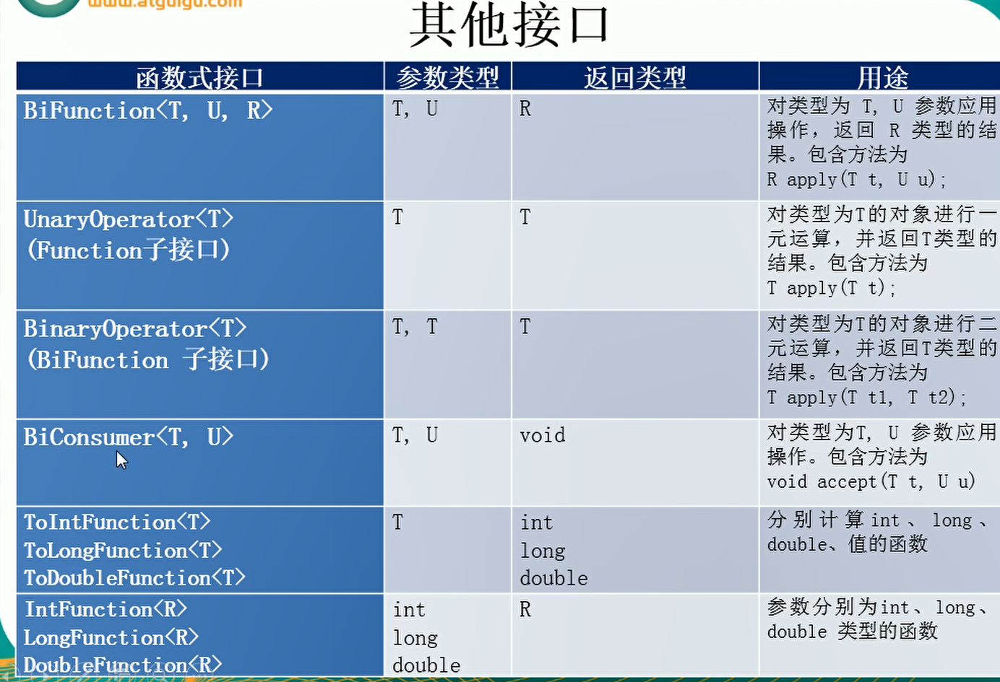


## 二: stream流

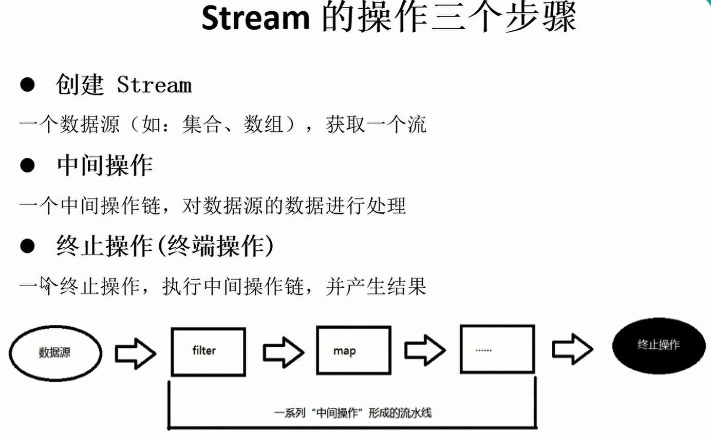

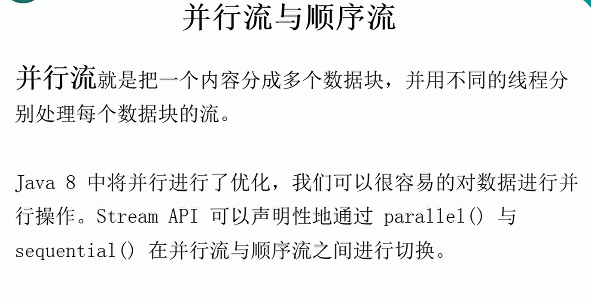

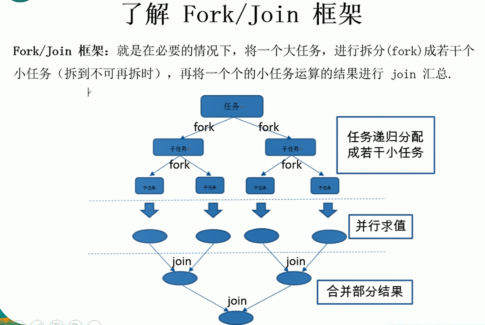


### Stream一些简单的api

```java
 中间操作, 不会立马执行
 /**
     * 切片与筛选
     * filter-接收Lambda, 从流中排除某些元素.
     * limit-截断流, 使其元素不超过给定数量
     * skip(n)-跳过元素, 返回一个扔掉了前n个元素的流. 若流中元素不足n个, 则返回一个空流. 与limit(n)互补
     * distinct-筛选, 通过流所生成元素的hashCode()和equals()去除重复元素
     */
     
	/**
     * 中间操作: 映射
     * map-接收Lambda, 将元素转换成为其他形式或提取信息. 接收一个函数作为参数, 该元素会被应用到每个元素上, 并将其映射成为一个			新的元素
     * flatMap-接收一个函数作为参数, 将流中的每个值都转换成为一个流, 然后把所有流连接成为一个流
     */
     
     /**
     * 中间操作: 排序
     * sorted()-自然排序(Comparable)
     * sorted(Comparator com)-定制排序(Comparator)
     */
     
     /**
     * 查找与配置
     * allMatch-检查是否匹配所有元素
     * anyMatch-检查是否至少匹配一个元素
     * noneMatch-检查是否没有匹配所有元素
     * findFirst-返回第一个元素
     * findAny-返回当前流中的任意元素
     * count-返回流中元素的总个数
     * max-返回流中最大值
     * min-返回流中最小值
     */
     
     /**
     * 归约:
     * reduce(T identity, BinaryOperation) / reduce(BinaryOperation)- 可以将流中的元素反复结合起来, 得到一个值
     */
      @Test
    public void test03() {
        List<Integer> list = Arrays.asList(1, 2, 3, 4, 5, 6, 7, 8, 9, 10);
        //计算总和, 初始值为0, 0赋给x,1赋给y,得到的结果赋值给x, 2赋给y....
        Integer sum = list.stream().reduce(0, (x, y) -> x + y);
        System.out.println(sum);

        //计算所有员工的工资总和
        Optional<Double> reduce = employees.stream().map(Employee::getSalary).reduce(Double::sum);
        System.out.println(reduce.get());
    }

	/**
     * 收集
     * -collect()将流转换为其他形式. 接收一个Collector接口的实现(可以提供一个Collectors), 用于给Stream中元素做汇总的方法
     */

 @Test
    public void test04() {
        //将名字收集到List中
        List<String> list = employees.stream().map(Employee::getName).collect(Collectors.toList());
        list.forEach(System.out::println);

        //将名字收集到Set中(不重复)
        Set<String> set = employees.stream().map(Employee::getName).collect(Collectors.toSet());
        set.forEach(System.out::println);

        //将名字收集到HashSet中
        HashSet<String> hashSet = employees.stream().map(Employee::getName).collect(Collectors.toCollection(HashSet::new));
        hashSet.forEach(System.out::println);

        //收集总数
        Long count = employees.stream().collect(Collectors.counting());
        System.out.println(count);

        //平均值
        Double avg = employees.stream().collect(Collectors.averagingDouble(Employee::getSalary));
        System.out.println(avg);

        //总和
        Double aDouble = employees.stream().collect(Collectors.summingDouble(Employee::getSalary));
        System.out.println(aDouble);

        //最大值
        Optional<Employee> max = employees.stream().collect(Collectors.maxBy((e1, e2) -> Double.compare(e1.getSalary(), e2.getSalary())));
        System.out.println(max.get());

        //最小值
        Optional<Double> collect = employees.stream().map(Employee::getSalary).collect(Collectors.minBy(Double::compare));
        System.out.println(collect);
    }

    //分组
    @Test
    public void test05() {
        Map<Employee.Status, List<Employee>> collect = employees.stream().collect(Collectors.groupingBy(Employee::getStatus));
        System.out.println(collect);
    }

    //多级分组
    @Test
    public void test06() {
        //先按Status分组, 然后再按照年龄分组
        Map<Employee.Status, Map<String, List<Employee>>> mapMap = employees.stream().collect(Collectors.groupingBy(Employee::getStatus, Collectors.groupingBy((e) -> {
            if (e.getAge() <= 35) {
                return "青年";
            } else if (e.getAge() <= 50) {
                return "中年";
            } else {
                return "老年";
            }
        })));
        System.out.println(mapMap);
    }

    ;

    //分区(分片), 满足条件的一个区, 不满足条件的一个区
    @Test
    public void test07() {
        Map<Boolean, List<Employee>> collect = employees.stream().collect(Collectors.partitioningBy(e -> e.getSalary() > 100));
        System.out.println(collect);
    }

    //收集
    @Test
    public void test08() {
        DoubleSummaryStatistics doubleSummaryStatistics = employees.stream().collect(Collectors.summarizingDouble(Employee::getSalary));
        System.out.println(doubleSummaryStatistics.getAverage());
        System.out.println(doubleSummaryStatistics.getMax());
        System.out.println(doubleSummaryStatistics.getMin());
        System.out.println(doubleSummaryStatistics.getCount());
        System.out.println(doubleSummaryStatistics.getSum());
    }

    //连接
    @Test
    public void test09(){
        String collect = employees.stream().map(Employee::getName).collect(Collectors.joining());
        System.out.println(collect);

         collect = employees.stream().map(Employee::getName).collect(Collectors.joining(",","[","]"));
        System.out.println(collect);
    }
```


### 流的小案例

话不多说, 直接上代码:

首先有两个实体类:

```java
/**
 * 交易员类
 */
public class Trader {
    private String name;
    private String city;

    public Trader() {
    }

    public Trader(String name, String city) {
        this.name = name;
        this.city = city;
    }

    @Override
    public String toString() {
        return "Trader{" +
                "name='" + name + '\'' +
                ", city='" + city + '\'' +
                '}';
    }

    public String getName() {
        return name;
    }

    public void setName(String name) {
        this.name = name;
    }

    public String getCity() {
        return city;
    }

    public void setCity(String city) {
        this.city = city;
    }
}

```

```java
/**
 * 交易类
 */
public class Transaction {
    @Override
    public String toString() {
        return "Transaction{" +
                "trader=" + trader +
                ", year=" + year +
                ", value=" + value +
                '}';
    }

    public Trader getTrader() {
        return trader;
    }

    public void setTrader(Trader trader) {
        this.trader = trader;
    }

    public int getYear() {
        return year;
    }

    public void setYear(int year) {
        this.year = year;
    }

    public int getValue() {
        return value;
    }

    public void setValue(int value) {
        this.value = value;
    }

    public Transaction() {
    }

    public Transaction(Trader trader, int year, int value) {
        this.trader = trader;
        this.year = year;
        this.value = value;
    }

    private Trader trader;
    private int year;
    private int value;
}

```

针对上面的两个实体类进行功能测试:

```java
public class TestTransaction {
    List<Transaction> transactions = null;

    @Before
    public void before() {
        Trader raoul = new Trader("Raoul", "Cambridge");
        Trader mario = new Trader("Mario", "Milan");
        Trader alan = new Trader("Alan", "Cambridge");
        Trader brian = new Trader("Brian", "Cambridge");
        transactions = Arrays.asList(
                new Transaction(brian, 2011, 300),
                new Transaction(raoul, 2012, 1000),
                new Transaction(raoul, 2012, 710),
                new Transaction(mario, 2012, 710),
                new Transaction(mario, 2012, 700),
                new Transaction(alan, 2012, 950)
        );

    }


    // 1. 找出2011年发生的所有交易, 并按交易额排序(从高到低)
    @Test
    public void test01() {
        Stream<Transaction> sorted = transactions.stream().filter(e -> e.getYear() == 2012).sorted((t1, t2) -> Integer.compare(t1.getValue(), t2.getValue()));
        sorted.forEach(System.out::println);
    }

    // 2. 交易员都在哪些不同的城市工作过?
    @Test
    public void test02() {
        transactions.stream().map(t -> t.getTrader().getCity()).distinct().forEach(System.out::println);
    }

    // 3. 查找所有来自剑桥的交易员, 并按姓名排序
    @Test
    public void test03() {
      /*  transactions.stream().filter(t->t.getTrader().getCity().equals("Cambridge")).map(Transaction::getTrader).sorted((t1,t2)->t1.getName().compareTo(t2.getName()))
                .distinct().forEach(System.out::println);*/

        transactions.stream().map(Transaction::getTrader).distinct().filter(t -> t.getCity().equals("Cambridge")).sorted((t1, t2) -> t1.getName().compareTo(t2.getName()))
                .forEach(System.out::println);
    }

    // 4. 返回所有交易员的姓名字符串, 按字母顺序排序
    @Test
    public void test04() {
        transactions.stream().map(t -> t.getTrader().getName()).sorted().forEach(System.out::println);

        System.out.println("============================================================");

        String reduce = transactions.stream().map(t -> t.getTrader().getName()).sorted().reduce("", String::concat);
        System.out.println(reduce);

        System.out.println("=============================================================");

        transactions.stream().map(t -> t.getTrader().getName()).flatMap(TestTransaction::filterCharacter)
                .sorted(String::compareToIgnoreCase).forEach(System.out::print);

    }

    public static Stream<String> filterCharacter(String str) {
        ArrayList<String> list = new ArrayList<>();
        for (Character c : str.toCharArray()) {
            list.add(c.toString());
        }
        return list.stream();
    }

    // 5. 有没有交易员是在米拉工作的?
    @Test
    public void test05() {
        boolean bool = transactions.stream().anyMatch(t -> t.getTrader().getCity().equals("Milan"));
        System.out.println(bool);
    }

    // 6. 打印生活在剑桥的交易员的所有交易额
    @Test
    public void test06() {
        Integer sum = transactions.stream().filter(e -> e.getTrader().getCity().equals("Cambridge")).map(Transaction::getValue).reduce(Integer::sum)
                .get();
        System.out.println(sum);
    }
    // 7. 在所有交易中, 最高的交易额是多少?
    @Test
    public void test07(){
        Optional<Integer> max = transactions.stream().map(Transaction::getValue).max(Integer::compareTo);
        System.out.println(max.get());
    }
    // 8. 找到交易额最小的交易
    @Test
    public void test08(){
        Optional<Transaction> min = transactions.stream().min((t1, t2) -> Integer.compare(t1.getValue(), t2.getValue()));
        System.out.println(min.get());
    }

    //java8并行流
    @Test
    public void test09(){
        Instant start = Instant.now();
        LongStream.rangeClosed(0,1000000000L).parallel().reduce(0,Long::sum);
        Instant end = Instant.now();
        System.out.println("消耗时间为:"+ Duration.between(start,end).toMillis());
    }
}

```


## 三: Optional类

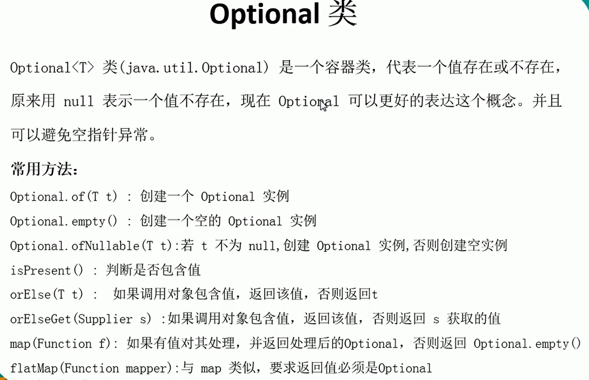

optional类主要是用于解决空指针问题, Optional类是一个集合类, 也可以说是一个容器


Optional类的几个方法:

> ```java
> /**
>  * Optional容器类的常用方法:
>  * -Optional.of(T t): 创建一个Optional实例
>  * -Optional.empty(): 创建一个空的Optional实例
>  * -OptionalOfNullable(T t): 若 t 不为 null, 创建 Optional 实例, 否则创建空实例
>  * -isPresent(): 判断是否包含值
>  * -orElse(T t): 判断调用对象包含值, 返回该值, 否则返回T
>  * -orElseGet(Supplier s): 如果调用对象包含值, 返回该值, 否则返回s获取的值
>  * -map(Function f): 如果有值对其处理, 并返回处理后的Optional, 否则返回Optional.empty()
>  * flatMap(Function mapper): 与map类似, 要求返回值必须是Optional
>  */
> ```


话不多说, 先来个小案例你就能看明白了:(最主要是看案例的最后一个方法, 看看是怎么避免空指针的)

```java
public class NewMan {
    //使用Optional来包装Godness避免空指针异常
    private Optional<Godness> godness = Optional.empty();
}
```

```java
 @Test
    public void test01() {
        //不能构建null实例
        Optional<Object> o = Optional.of(null);
        System.out.println(o.get());
    }

    @Test
    public void test02() {
        //构建一个空的Optional实例, 还不能get
        Optional<Employee> o = Optional.empty();

        Optional<Object> o1 = Optional.ofNullable(null);
        //判断是否有值
        if (o1.isPresent()) {
            System.out.println(o1);
        }
        //如果有值则返o, 如果没值则返回传入的对象
        Employee o2 = o.orElse(new Employee("张三", 12, 999.909, Employee.Status.FREE));
        System.out.println(o2);

        Object o3 = o1.orElseGet(() -> new Employee());
        System.out.println(o3);

    }

    @Test
    public void test03() {
        Optional<Employee> op = Optional.ofNullable(new Employee("张三", 23, 88.8888, Employee.Status.FREE));
        Optional<String> s = op.map(Employee::getName);
        System.out.println(s);

        //要求返回一个Optional对象
        Optional<String> s1 = op.flatMap(e -> Optional.of(e.getName()));
        System.out.println(s1);
    }

    //测试空指针
    @Test
    public void test04() {
        //正常写法
        Man man = new Man();
        String godnessName = getGodnessName(man);
        System.out.println(godnessName);

        //升级写法
        Optional<NewMan> op = Optional.ofNullable(null);
        getGodnessName2(op);

    }

    //需求: 获取一个男人心目中女神的名字
    public String getGodnessName(Man man) {
        if (man != null) {
            Godness godness = man.getGodness();
            if (godness != null) {
                return godness.getName();
            }
        }
        return "苍老师";
    }


    //升级版, 避免空指针异常
    public String getGodnessName2(Optional<NewMan> op) {
        //如果op未空则new NewMan, 如果Godness为空, 则new Godness
        return op.orElse(new NewMan()).getGodness().orElse(new Godness()).getName();
    }
```


四: 接口中的默认方法:

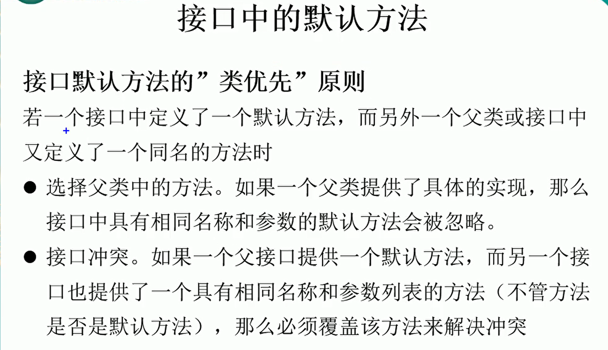

## 四: 时间和日期


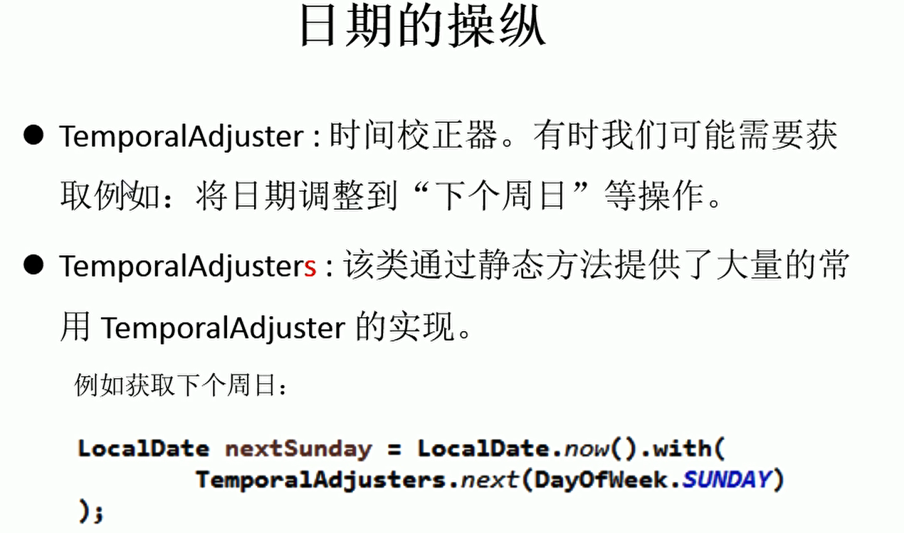

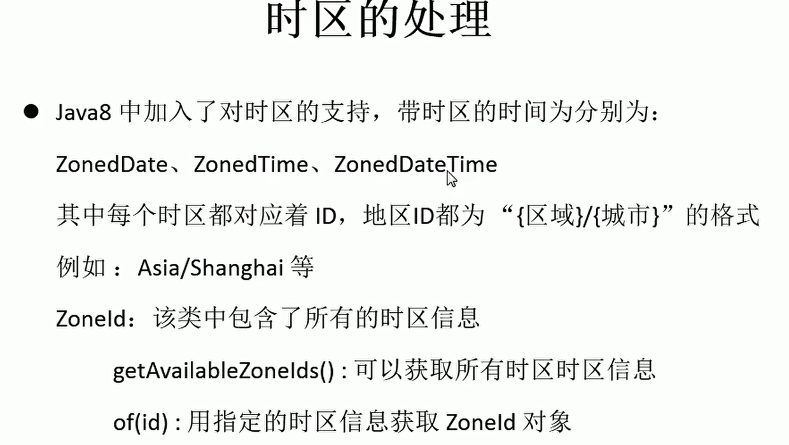

1. 相关的类

```
    /**
     * 1. LocalDate LocalTime   LocalDateTime
     */
     
     /**
     * 2. Instant: 时间戳(以unix元年到某个时间之间的毫秒数)
     */
     
     /**
     * 3. Duration: 计算两个时间之间的间隔
     */
     
     /**
     * 4: Period: 计算两个日期之间的间隔
     */
     
     /**
     * 5. TemporalAdjuster: 时间校正器, 可以将日期调整到"下个周日等操作"
     */
     
     /**
     * 6. DateTimeFormatter: 格式化时间/日期
     */
     
     /**
     * 时区:
     *   ZonedDate, ZonedTime, ZonedDateTime
     */
     
```


小案例:

```java
public class TestLocalDateTime {
    /**
     * 1. LocalDate LocalTime   LocalDateTime
     */

    @Test
    public void test01() {
        LocalDateTime ldt1 = LocalDateTime.now();
        System.out.println(ldt1);

        LocalDateTime ldt2 = LocalDateTime.of(2021, 10, 21, 12, 32, 12);
        System.out.println(ldt2);

        //加一年
        System.out.println(ldt1.plusYears(1));

        //减一个月
        System.out.println(ldt1.minusMonths(1));
    }

    /**
     * 2. Instant: 时间戳(以unix元年到某个时间之间的毫秒数)
     */
    @Test
    public void test02() {
        Instant instant = Instant.now();//默认获取utc时区
        System.out.println(instant);//2021-01-23T07:28:40.759438Z
        OffsetDateTime offsetDateTime = instant.atOffset(ZoneOffset.ofHours(8));
        System.out.println(offsetDateTime);//2021-01-23T15:28:40.759438+08:00

        //获取毫秒数
        System.out.println(instant.toEpochMilli());
        //根据指定毫秒数创建一个时间
        System.out.println(Instant.ofEpochMilli(1));//1970-01-01T00:00:00.001Z
    }

    /**
     * 3. Duration: 计算两个时间之间的间隔
     */
    @Test
    public void test03() throws InterruptedException {
        Instant instant1 = Instant.now();
        Thread.sleep(1000);
        Instant instant2 = Instant.now();
        Duration duration = Duration.between(instant1, instant2);
        /**
         * to...和get..都是用来获取时间, 不足1时就是0
         */
        //获取两个时间之间的秒
        System.out.println(duration.getSeconds());
        //获取两个时间之间的毫秒
        System.out.println(duration.toMillis());

        System.out.println("===================================");

        LocalTime localTime1 = LocalTime.now();
        Thread.sleep(1000);
        LocalTime localTime2 = LocalTime.now();
        System.out.println(Duration.between(localTime1, localTime2).toDays());
    }

    /**
     * 4: Period: 计算两个日期之间的间隔
     */
    @Test
    public void test04() {
        LocalDate localDate = LocalDate.of(2021, 1, 1);
        LocalDate now = LocalDate.now();
        System.out.println(Period.between(localDate, now).getYears());
        System.out.println(Period.between(localDate, now).getMonths());
        System.out.println(Period.between(localDate, now).getDays());
    }

    /**
     * 5. TemporalAdjuster: 时间校正器, 可以将日期调整到"下个周日等操作"
     */
    @Test
    public void test05() {
        LocalDateTime now = LocalDateTime.now();
        System.out.println(now);

        //把日调整为10号
        LocalDateTime dayOfMonth = now.withDayOfMonth(10);
        System.out.println(dayOfMonth);

        //调整为下一个周一
        LocalDateTime with = now.with(TemporalAdjusters.next(DayOfWeek.MONDAY));
        System.out.println(with.format(DateTimeFormatter.ofPattern("yyyy-MM-dd")));

        //自定义返回值
        LocalDateTime with1 = now.with(l -> {
            LocalDateTime ldt = (LocalDateTime) l;
            //获取到周几
            DayOfWeek dayOfWeek = ldt.getDayOfWeek();
            if (dayOfWeek.equals(DayOfWeek.FRIDAY)) {
                return ldt.plusDays(2);
            } else {
                return ldt.plusDays(1);
            }
        });
        System.out.println(with1.format(DateTimeFormatter.ofPattern("yy-MM-dd")));
    }

    /**
     * DateTimeFormatter: 格式化时间/日期
     */
    @Test
    public void test06() {
        DateTimeFormatter dtf = DateTimeFormatter.ISO_DATE;
        LocalDateTime ldt = LocalDateTime.now();
        String format = ldt.format(dtf);
        System.out.println(format);

        System.out.println("------------------------------------");
        DateTimeFormatter dateTimeFormatter = DateTimeFormatter.ofPattern("yyyy年MM月dd日 HH:mm:ss");
        String format1 = ldt.format(dateTimeFormatter);
        System.out.println(format1);

        //两个日期之间的比较
        int i = ldt.compareTo(ldt.plusSeconds(1));
        System.out.println(i);

        //解析一个字符串
        LocalDateTime parse = LocalDateTime.parse(format1, dateTimeFormatter);
        System.out.println(parse);
    }

    /**
     * 时区:
     *   ZonedDate, ZonedTime, ZonedDateTime
     */
    @Test
    public void test07() {
        //获取所有时区
        Set<String> availableZoneIds = ZoneId.getAvailableZoneIds();
        System.out.println(availableZoneIds);

        //根据当前系统时间来获"Europe/Tallinn"时区的时间, 这样就可以知道其他地方现在时什么时候了
        LocalDateTime now = LocalDateTime.now(ZoneId.of("Europe/Tallinn"));
        System.out.println(now);

        LocalDateTime now1 = LocalDateTime.now(ZoneId.of("Asia/Shanghai"));
        System.out.println(now1);//系统当前时间: 2021-01-24T12:31:33.870619900
        ZonedDateTime zonedDateTime = now1.atZone(ZoneId.of("Asia/Shanghai"));
        System.out.println(zonedDateTime);//带时区的时间: 2021-01-24T12:31:33.870619900+08:00[Asia/Shanghai]  +08:00表示与utc相差八个钟


    }
}
```


## 五: 重复注解与类型注解


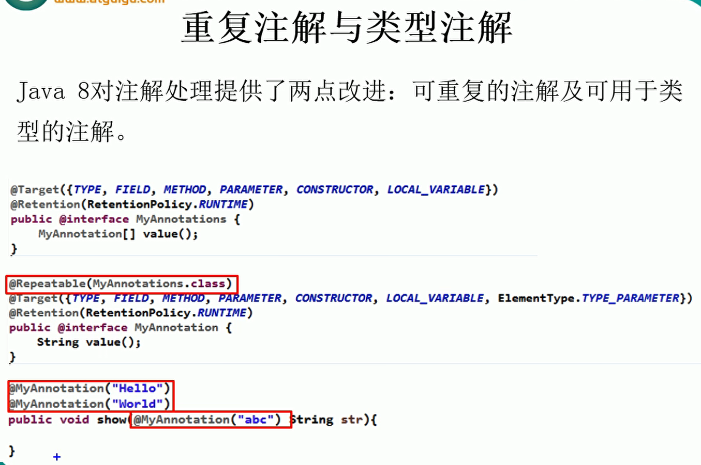

```java
/**
 * 重复注解与类型注解
 *
 * 总结: 如何声明一个可重复注解(可重复标注在同一个类/方法/属性上)
 *      1. 声明一个可重复注解
 *          public @interface MyAnnotaion {...}
 *          
 *      2. 再声明一个注解容器, 在这个容器中声明一下这个可重复注解(以数组的形式声明)
 *          public @interface MyAnnotationCollector {
 *              MyAnnotaion[] value();
 *          }
 *
 *      3. 可重复注解上标注@Repeatable(注解容器.class)
 *          @Repeatable(MyAnnotationCollector.class)
 *          public @interface MyAnnotaion {...}

 *      4. 然后就可以使用这个可重复的注解了
 */
```


# java9新特性

 

## 模块化(提供导入导出的实现)

一个工程下面可以建立好多个module, 每一个module的scr下面建立一个module-info.java的文件, 里面包含了可以导入/导出哪个module的哪个包

1. 导出

```java
module moduleName{
    //导出的包名
    exports: com.atguigu.bean
}
```

2. 导入

```java
module moduleName{
    //导入的包名
    requires: com.atguigu.bean
}
```


## 钻石操作符

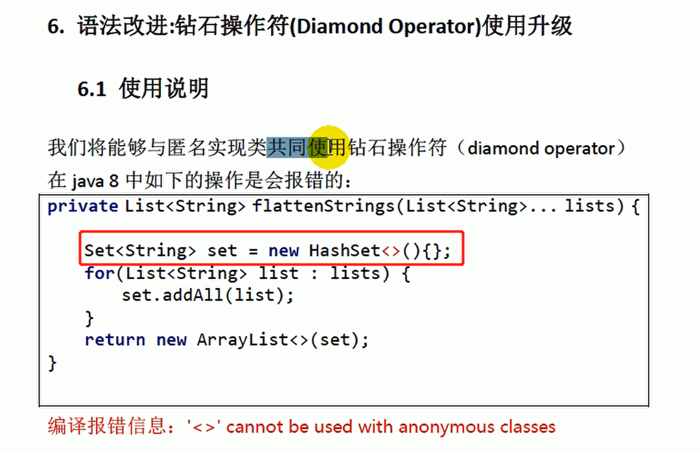


## 异常处理

```java
/**
 * java9的异常处理
 */
public class TestTyt {
    /**
     * 正常的异常处理
     */
    @Test
    public void test01() {
        InputStreamReader reader = new InputStreamReader(System.in);
        try {
            reader.read();
        } catch (IOException e) {
            e.printStackTrace();
        } finally {
            //要自己手动的关闭资源, 非常的麻烦
            try {
                reader.close();
            } catch (IOException e) {
                e.printStackTrace();
            }
        }
    }

    /**
     * java8中的异常处理:
     * 要求资源对象的实例化必须在try的一对()内完成
     * 在try中的资源已经暗含了是final了, 不能再给这个资源赋值了
     * 多个资源用;隔开
     */
    @Test
    public void test02() {
        //这样就不用自己手动关闭资源了
        try (InputStreamReader reader = new InputStreamReader(System.in);
             OutputStreamWriter writer = new OutputStreamWriter(System.out)) {
            //Cannot assign a value to final variable 'reader'
            //reader = null;
            reader.read();
        } catch (IOException e) {
            e.printStackTrace();
        }
    }

    /**
     * java9中的异常处理:
     * 资源对象的实例可以不用在try的一对()内完成, 在try的()中传入资源的实例即可
     * 在try中的资源已经暗含了是final了, 不能再给这个资源赋值了
     * 多个资源用;隔开
     */
    @Test
    public void test03() {
        InputStreamReader reader = new InputStreamReader(System.in);
        OutputStreamWriter writer = new OutputStreamWriter(System.out);
        //这样就不用自己手动关闭资源了
        try (reader;writer) {
            reader.read();
        } catch (IOException e) {
            e.printStackTrace();
        }
    }
}

```


## 有关String类的改动

String, StringBuffer, StringBuilder在java8及以前底层是用char[]来存储的, 在java9开始就换成了用byte[] (encoding flag来标注存储的是字符还是英文)来存储了, 这样就可以节省了大量的空间

> String: 不可变的字符串
>
> StringBuffer: 可变的字符串序列, 线程安全的, 效率低
>
> StringBuilder: 可变的字符串序列, 线程不安全的, 效率高(java5的时候新增)


## 只读集合

```java
  //创建一个只读集合
        List<String> readList = Collections.unmodifiableList(list);
        //试图在修改只读集合会出错
        readList.add("jianhong");
        readList.forEach(System.out::println);

```


# java11新特性

## 创建只读集合类的几种方式

```java
public class OnlyReadColletion {
 
    @Test
    public void test01() {
        ArrayList<String> list = new ArrayList<>();
        list.add("jacklu");
        list.add("yangmin");
        list.add("zhouzhou");

        //创建一个只读集合
        List<String> readList = Collections.unmodifiableList(list);
        //试图在修改只读集合会出错
        //readList.add("jianhong");
        readList.forEach(System.out::println);
    }

    @Test
    public void test02() {
        //创建一个只读的set
        Set<Integer> set = Collections.unmodifiableSet(new HashSet<>(Arrays.asList(1, 2, 3, 4, 5)));
        //也是不能够修改只读集合的
        //set.add(520);
        set.forEach(System.out::println);

        //创建一个只读的map
        Map<String, Integer> map = Collections.unmodifiableMap(new HashMap<>() {
            //用代码块给实现类添加数据
            {
                put("yangmin", 21);
                put("jacklu", 23);
            }
        });
        //不可修改只读的map
        //map.put("jianhong", 22);
        map.forEach((k, v) -> {
            System.out.println(k + "--->" + v);
        });
    }

    /**
     * java9中创建一个只读的集合
     */
    @Test
    public void test03(){
        //通过of创建一个只读集合(通过接口中的静态方法来创建,Set和Map的创建也一样, 可以通过of方法来创建)
        List<Integer> integers = List.of(1, 2, 3, 4, 5);
        //integers.add(6);
        System.out.println(integers);

        Map<String, Integer> map = Map.of("jacklu", 22, "yangmin", 20);
        System.out.println(map);//{yangmin=20, jacklu=22}

        //创建只读的map的另一种方式
        Map<String, Integer> entries = Map.ofEntries(Map.entry("jacklu", 22), Map.entry("yangmin", 20));
        System.out.println(entries);
    }
}
```


## StreamApi

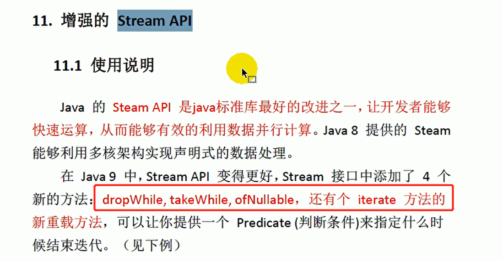

 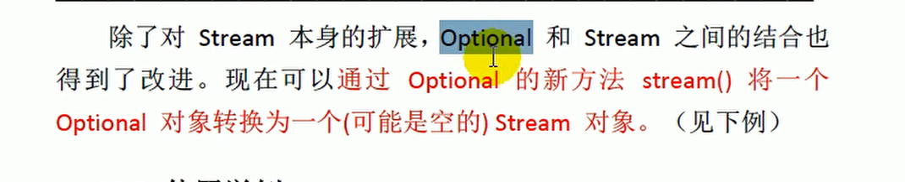


## streamApi演示

```java
public class StreamTest {
    /**
     * java9中新增了4个方法:
     * takeWhile(): 从前往后拿按顺序拿, 直到不符合条件就停止, 这点与filter不同, filter是不会停止, filter是全部遍历的
     */

    /**
     * takeWhile(): 不符合条件就停止遍历收集
     */
    @Test
    public void test01() {
        Arrays.asList(12, 342, 55, 63, 999, 2, 56, 75, 1, 23, 44).stream()
                .takeWhile(x -> x < 999).forEach(System.out::println);
    }

    /**
     * dropWhile(): 与takeWhile相反, 不符合条件就停止drop
     */
    @Test
    public void test02() {
        Arrays.asList(12, 342, 55, 63, 999, 2, 56, 75, 1, 23, 44).stream()
                //>=99就停止drop
                .dropWhile(x -> x < 999).forEach(System.out::println);
    }

    /**
     * ofNullable(): 允许我们创建一个空元素的stream, 可以包含一个非空元素, 也可以创建一个空stream
     */
    @Test
    public void test03() {
        //当流中只有一个元素时, 这个元素不能为null
        //Stream.of(null).forEach(System.out::println);

        //使用java9中的ofNullable方法, 当流中只有一个元素时, 这个元素可以为Null
        Stream.ofNullable(null).forEach(System.out::println);
    }

    /**
     * iterator(): 三个参数, 中间的参数是迭代条件
     */
    @Test
    public void test04() {
        /**
         * 复习: Stream的实例化
         *      1. 通过集合类的stream()
         *      2. 通过数组工具类Arrays.stream()
         *      3. Stream中的静态方法Stream.of()或者Stream.ofNullable()
         *      4. 通过迭代器Stream.iterate()
         */

        Stream.iterate(0, x -> x + 1).limit(10).forEach(System.out::println);

        //跟上面一样的功能, 中间的参数是迭代条件
        Stream.iterate(0, x -> x < 10, x -> x + 1).forEach(System.out::println);
    }
}
```


## optionalApi演示

```java
/**
 * Optional中提供了转换为Stream的方法stream()
 */
public class OptionalTest {
    @Test
    public void test01(){
        List<String> list = new ArrayList<>();
        list.add("jacklu");
        list.add("yangmin");
        list.add("zhouzhou");
        Stream<List<String>> stream = Optional.of(list).stream();
        System.out.println(stream.count());//1

        //合并流里面的元素
        List<String> list1 = new ArrayList<>();
        list1.add("jacklu");
        list1.add("yangmin");
        list1.add("zhouzhou");
        //合并流
        Stream<String> stringStream = Optional.of(list1).stream().flatMap(x -> x.stream());
        System.out.println(stringStream.count());//3
    }
}
```


## 只读集合:

集合类的接口可以通过of静态函数来构造一个只读集合:

```java
 		List<String> list = List.of("aaa", "bbb", "ccc");
		//这个也是一个只读集合
        List<String> asList = Arrays.asList("aa");
```

## 字符串的操作

```java
/**
 * java11新增了对字符串的操作
 *  1. str.strip(): 去掉左右的空白
 *  2. str.stripLeading(): 去除首部的空白
 *  3. str.stripTrailing(): 去除尾部的空白
 *  4. str.repeat(): 重复多少次
 *  5. str.lines(): 返回一个流
 */
```

## 对流的操作

```java
 /**
     * 测试文件流的transferTo(): 可以直接的把输入流中的所有数据直接赋值到输出流当中, 不需要中间的缓冲数组
     */
    @Test
    public void test02() throws FileNotFoundException {
        FileInputStream fileInputStream = new FileInputStream(new File("src/com/jacklu/java11/file"));
        var distination = new FileOutputStream(new File("distination"));
        try (fileInputStream;distination){
            fileInputStream.transferTo(distination);
        }catch (IOException e){
        }
    }
```

## HttpClient

```java
@Test
    public void test01() throws IOException, InterruptedException {
        HttpClient httpClient = HttpClient.newHttpClient();
        HttpRequest httpRequest = HttpRequest.newBuilder(URI.create("http://www.baidu.com")).build();
        HttpResponse.BodyHandler<String> bodyHandler = HttpResponse.BodyHandlers.ofString();
		//同步的方式
        HttpResponse<String> httpResponse = httpClient.send(httpRequest, bodyHandler);
        
        System.out.println(httpResponse.body());
    }


 	@Test
    public void test02() throws IOException, InterruptedException, ExecutionException {
        HttpClient httpClient = HttpClient.newHttpClient();
        HttpRequest httpRequest = HttpRequest.newBuilder(URI.create("http://www.baidu.com")).build();
        HttpResponse.BodyHandler<String> bodyHandler = HttpResponse.BodyHandlers.ofString();
        //异步的
        CompletableFuture<HttpResponse<String>> sendAsync = httpClient.sendAsync(httpRequest, bodyHandler);
        HttpResponse<String> response = sendAsync.get();
        
        System.out.println(response.body());
    }
```

 

## 编译

> 在java11中要运行一个java文件可以直接使用命令  java xxx.java即可运行, 不必javac进行编译, 不会生成class文件
>
> 执行源文件中的第一个类必须包含主方法, 并且不可以使用别的源文件中自定义的类, 本文件中的自定义的类是可以使用的


